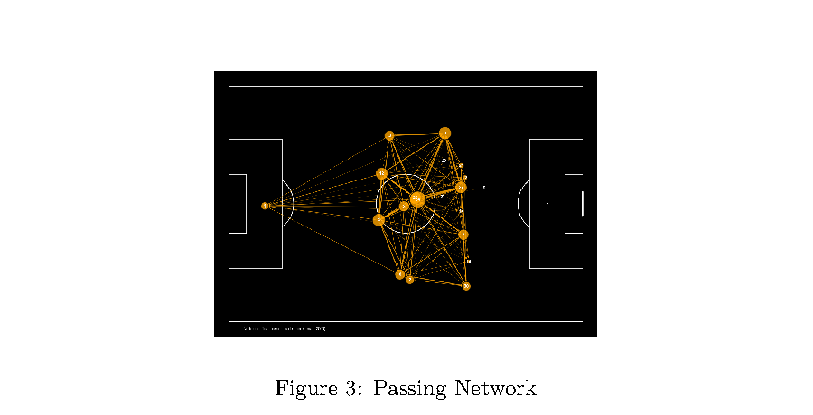
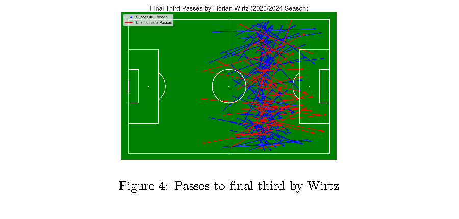
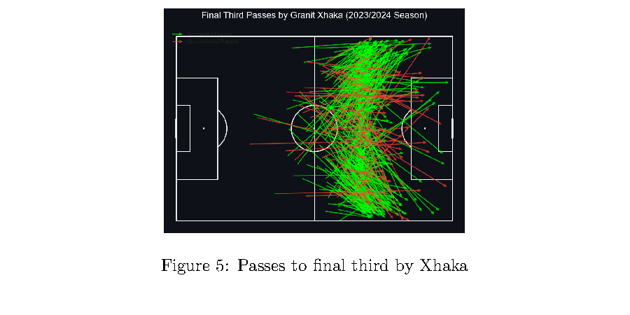

# Bayer Leverkusen 2023/24 Tactical Analysis

This repository is a publication-only project for a standalone tactical analysis of Bayer Leverkusen's 2023/24 season, with a particular focus on Florian Wirtz, Granit Xhaka, progression patterns, and overall team structure.

The full report is available here: [bayer-leverkusen-23-24-report.pdf](./doc/bayer-leverkusen-23-24-report.pdf)

## Overview

Written by **Ramdev Murali** in **September 2024**, this report uses match-event data and visual analysis to examine how Bayer Leverkusen combined attacking creativity, midfield control, and defensive organization during one of the club's strongest modern seasons.

This repo does not include source code. It is intentionally kept minimal and centered on the final report and selected visuals.

## Featured Figures

### Passing Network

### Final Third Passes by Florian Wirtz

### Final Third Passes by Granit Xhaka

## What the Report Covers

- Late-goal scoring patterns and end-of-match resilience
- Expected goals versus actual goals across the season
- Passing network structure and possession flow
- Final-third progression and the Xhaka-Wirtz connection
- Pressing intensity through PPDA
- Team defensive action heatmaps and top defensive contributors
- Pass accuracy and volume across the squad
- Wirtz's chance creation, carries, and advanced-area influence
- Xhaka's role in buildup, tempo control, and progression
- Defensive positioning and structural flexibility

## Key Takeaways

- **Florian Wirtz** emerges as the team's creative hub in advanced areas, combining key passes, carries, and final-third involvement.
- **Granit Xhaka** acts as the central organizer, driving circulation, progression, and control from deeper midfield zones.
- Bayer Leverkusen's attack is built on both **controlled progression** and **high-quality chance creation**, with finishing often matching or outperforming expected output.
- The team shows a strong collective defensive identity, with pressing and defensive actions distributed across multiple positions.
- The passing and spatial analysis point to a side that is both **tactically flexible** and **structurally coherent** in buildup and transition phases.

## Repository Contents

- `doc/bayer-leverkusen-23-24-report.pdf`: Full written report
- `doc/passing-network.png`: Passing-network figure
- `doc/final-third-passes-wirtz.png`: Wirtz final-third passing figure
- `doc/final-third-passes-xhaka.png`: Xhaka final-third passing figure
- `README.md`: Project summary and visual preview

## Read the Report

- [Open the full report](./doc/bayer-leverkusen-23-24-report.pdf)
